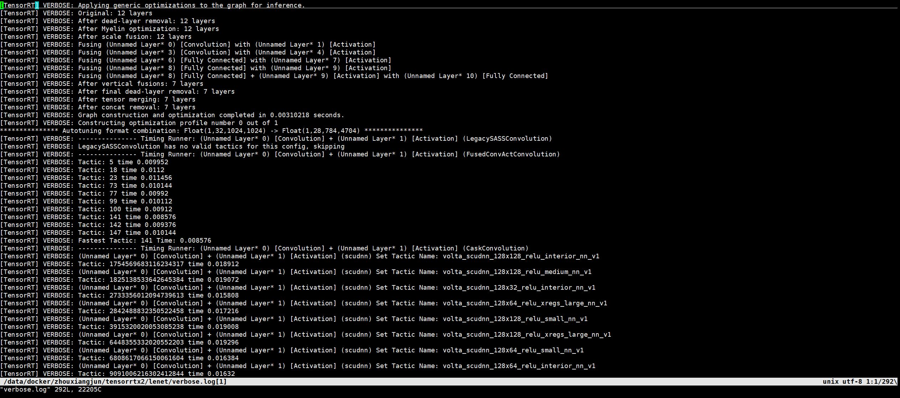

## Check the process of creating engine

### set verbose
```Python
# gLogger = trt.Logger(trt.Logger.INFO)
gLogger = trt.Logger(trt.Logger.VERBOSE)
```

### save log
```bash
python lenet.py -s 2>verbose.log
```


## learn optimizations to the graph for inference
### result
```
[TensorRT] VERBOSE: After reformat layers: 7 layers
[TensorRT] VERBOSE: Block size 18944
[TensorRT] VERBOSE: Block size 5120
[TensorRT] VERBOSE: Block size 0
[TensorRT] VERBOSE: Total Activation Memory: 24064
[TensorRT] INFO: Detected 1 inputs and 1 output network tensors.
[TensorRT] VERBOSE: Engine generation completed in 2.31989 seconds.
[TensorRT] VERBOSE: Engine Layer Information:
[TensorRT] VERBOSE: Layer(FusedConvActDirect): (Unnamed Layer* 0) [Convolution] + (Unnamed Layer* 1) [Activation], Tactic: 141, data[Float(1,32,32)] -> (Unnamed Layer* 1) [Activation]_output[Float(6,28,28)]
[TensorRT] VERBOSE: Layer(PoolingTiled): (Unnamed Layer* 2) [Pooling], Tactic: 7405838, (Unnamed Layer* 1) [Activation]_output[Float(6,28,28)] -> (Unnamed Layer* 2) [Pooling]_output[Float(6,14,14)]
[TensorRT] VERBOSE: Layer(FusedConvActDirect): (Unnamed Layer* 3) [Convolution] + (Unnamed Layer* 4) [Activation], Tactic: 133, (Unnamed Layer* 2) [Pooling]_output[Float(6,14,14)] -> (Unnamed Layer* 4) [Activation]_output[Float(16,10,10)]
[TensorRT] VERBOSE: Layer(PoolingTiled): (Unnamed Layer* 5) [Pooling], Tactic: 7405828, (Unnamed Layer* 4) [Activation]_output[Float(16,10,10)] -> (Unnamed Layer* 5) [Pooling]_output[Float(16,5,5)]
[TensorRT] VERBOSE: Layer(FullyConnected): (Unnamed Layer* 6) [Fully Connected] + (Unnamed Layer* 7) [Activation], Tactic: 0, (Unnamed Layer* 5) [Pooling]_output[Float(16,5,5)] -> (Unnamed Layer* 7) [Activation]_output[Float(120,1,1)]
[TensorRT] VERBOSE: Layer(cudaFusedBlockLocalMLP): 2-layer MLP: (Unnamed Layer* 8) [Fully Connected] + (Unnamed Layer* 9) [Activation] -> (Unnamed Layer* 10) [Fully Connected], Tactic: 0, (Unnamed Layer* 7) [Activation]_output[Float(120,1,1)] -> (Unnamed Layer* 10) [Fully Connected]_output[Float(10,1,1)]
[TensorRT] VERBOSE: Layer(SoftMax): (Unnamed Layer* 11) [Softmax], Tactic: 1001, (Unnamed Layer* 10) [Fully Connected]_output[Float(10,1,1)] -> prob[Float(10,1,1)] 
```

### example 1
```
[TensorRT] VERBOSE: *************** Autotuning format combination: Float(1,5,25,400) -> Float(1,1,1,120) ***************
[TensorRT] VERBOSE: --------------- Timing Runner: (Unnamed Layer* 6) [Fully Connected] + (Unnamed Layer* 7) [Activation] (CaskFullyConnected)
[TensorRT] VERBOSE: (Unnamed Layer* 6) [Fully Connected] + (Unnamed Layer* 7) [Activation] (caskFullyConnectedFP32) Set Tactic Name: volta_sgemm_128x32_relu_nn_v1
[TensorRT] VERBOSE: Tactic: 8190451076631534509 time 0.028288
[TensorRT] VERBOSE: (Unnamed Layer* 6) [Fully Connected] + (Unnamed Layer* 7) [Activation] (caskFullyConnectedFP32) Set Tactic Name: volta_sgemm_32x128_relu_nn_v1
[TensorRT] VERBOSE: Tactic: 5918215112415401770 time 0.028576
[TensorRT] VERBOSE: (Unnamed Layer* 6) [Fully Connected] + (Unnamed Layer* 7) [Activation] (caskFullyConnectedFP32) Set Tactic Name: volta_sgemm_64x64_relu_nn_v1
[TensorRT] VERBOSE: Tactic: 3514307671120560729 time 0.052768
[TensorRT] VERBOSE: (Unnamed Layer* 6) [Fully Connected] + (Unnamed Layer* 7) [Activation] (caskFullyConnectedFP32) Set Tactic Name: volta_sgemm_128x128_relu_nn_v1
[TensorRT] VERBOSE: Tactic: 3380542644225735979 time 0.089504
[TensorRT] VERBOSE: (Unnamed Layer* 6) [Fully Connected] + (Unnamed Layer* 7) [Activation] (caskFullyConnectedFP32) Set Tactic Name: volta_sgemm_128x64_relu_nn_v1
[TensorRT] VERBOSE: Tactic: 2365066484941477695 time 0.0528
[TensorRT] VERBOSE: Fastest Tactic: 8190451076631534509 Time: 0.028288
[TensorRT] VERBOSE: --------------- Timing Runner: (Unnamed Layer* 6) [Fully Connected] + (Unnamed Layer* 7) [Activation] (CudaFullyConnected)
[TensorRT] VERBOSE: Tactic: 0 time 0.010816
[TensorRT] VERBOSE: Tactic: 1 time 0.011584
[TensorRT] VERBOSE: Fastest Tactic: 0 Time: 0.010816
[TensorRT] VERBOSE: >>>>>>>>>>>>>>> Chose Runner Type: CudaFullyConnected Tactic: 0
```
```
[kimi] 这段日志来自 NVIDIA 的 TensorRT，它是一种用于深度学习推理的高性能库。TensorRT 能够将深度学习模型优化为高效的推理引擎，从而在 GPU 上实现快速运行。日志内容主要描述了 TensorRT 在自动调优过程中的一些细节。

以下是对日志内容的逐条解释：

Autotuning format combination: 这表示 TensorRT 正在自动调优数据格式的组合。具体来说，它正在尝试将输入格式 Float(1,5,25,400) 转换为输出格式 Float(1,1,1,120)。

Timing Runner: 这表示 TensorRT 正在测量不同策略（tactics）的执行时间。这里涉及到的是一个全连接层（Fully Connected Layer）和一个激活层（Activation Layer）的组合。

Tactic Names: TensorRT 尝试了不同的策略名称，如 volta_sgemm_128x32_relu_nn_v1，volta_sgemm_32x128_relu_nn_v1 等。这些名称通常与底层硬件优化有关，例如 volta 可能指的是 NVIDIA Volta 架构的 GPU。

Tactic Times: 每种策略的执行时间被记录下来。例如，volta_sgemm_128x32_relu_nn_v1 的执行时间为 0.028288 秒。

Fastest Tactic: TensorRT 会记录并选择最快的策略。在这个例子中，volta_sgemm_128x32_relu_nn_v1 是最快的策略，执行时间为 0.028288 秒。

Chose Runner Type and Tactic: 最后，TensorRT 选择了 CudaFullyConnected 作为运行类型，并选择了策略 0，其执行时间为 0.010816 秒。这表示在所有尝试的策略中，这是一个最优的选择。

总结来说，TensorRT 在自动调优过程中尝试了不同的策略，并最终选择了执行时间最短的策略来优化模型的推理性能。这对于在实际应用中实现快速、高效的深度学习推理是非常关键的。
```

### example 2: 2-layer MLP
```
[TensorRT] VERBOSE: *************** Autotuning format combination: Float(1,1,1,120) -> Float(1,1,1,10) ***************
[TensorRT] VERBOSE: --------------- Timing Runner: 2-layer MLP: (Unnamed Layer* 8) [Fully Connected] + (Unnamed Layer* 9) [Activation] -> (Unnamed Layer* 10) [Fully Connected] (CudnnMLPFC)
[TensorRT] VERBOSE: Tactic: 0 skipped. Scratch requested: 672, available: 0
[TensorRT] VERBOSE: Tactic: 1 skipped. Scratch requested: 672, available: 0                                                                                                                                                          
[TensorRT] VERBOSE: Fastest Tactic: -3360065831133338131 Time: 3.40282e+38
[TensorRT] VERBOSE: --------------- Timing Runner: 2-layer MLP: (Unnamed Layer* 8) [Fully Connected] + (Unnamed Layer* 9) [Activation] -> (Unnamed Layer* 10) [Fully Connected] (CudnnMLPMM)
[TensorRT] VERBOSE: Tactic: 0 skipped. Scratch requested: 672, available: 0
[TensorRT] VERBOSE: Fastest Tactic: -3360065831133338131 Time: 3.40282e+38
[TensorRT] VERBOSE: --------------- Timing Runner: 2-layer MLP: (Unnamed Layer* 8) [Fully Connected] + (Unnamed Layer* 9) [Activation] -> (Unnamed Layer* 10) [Fully Connected] (CudaMLP)
[TensorRT] VERBOSE: Tactic: 0 time 0.017696
[TensorRT] VERBOSE: Fastest Tactic: 0 Time: 0.017696
[TensorRT] VERBOSE: >>>>>>>>>>>>>>> Chose Runner Type: CudaMLP Tactic: 0
```
```
[kimi] 这段日志同样来自 NVIDIA 的 TensorRT，描述了在自动调优过程中的一些细节。以下是对日志内容的逐条解释：

1. **Autotuning format combination**: TensorRT 正在自动调优数据格式的组合。这次的目标是将输入格式 `Float(1,1,1,120)` 转换为输出格式 `Float(1,1,1,10)`。

2. **Timing Runner**: TensorRT 正在测量不同策略（tactics）的执行时间。这里涉及到的是一个两层的多层感知机（MLP），包括一个全连接层（Fully Connected Layer）和一个激活层（Activation Layer），然后是另一个全连接层。

3. **Tactic Skipped**: 在某些情况下，TensorRT 会跳过某些策略。这通常发生在所需的临时存储空间（scratch space）不足时。例如，日志中提到 "Scratch requested: 672, available: 0"，意味着所需的 672 字节的临时存储空间不可用。

4. **Fastest Tactic**: 当所有策略都被跳过时，TensorRT 会记录一个非常大的执行时间，如 `3.40282e+38`，这表示没有有效的策略被执行。

5. **Chose Runner Type and Tactic**: 最后，TensorRT 选择了 `CudaMLP` 作为运行类型，并选择了策略 0，其执行时间为 0.017696 秒。这表示在所有尝试的策略中，这是一个最优的选择。

具体来说，日志中的几部分内容如下：

- **CudnnMLPFC** 和 **CudnnMLPMM**: 这两种策略都因为所需的临时存储空间不足而被跳过。
- **CudaMLP**: TensorRT 选择了这种策略，并记录了策略 0 的执行时间为 0.017696 秒。

总结来说，TensorRT 在自动调优过程中尝试了不同的策略，并最终选择了执行时间最短的策略来优化模型的推理性能。在这个例子中，由于临时存储空间的限制，某些策略被跳过，最终选择了 `CudaMLP` 策略。这对于在实际应用中实现快速、高效的深度学习推理是非常关键的。
```