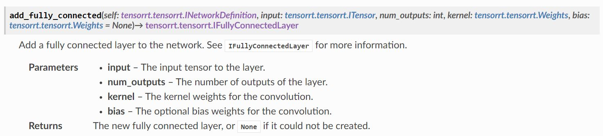
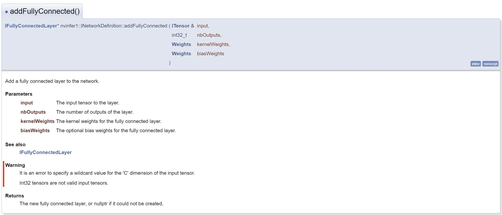

## Python API
Overall flow is similar in C++ API.

### create TensorRT engine
```
api_to_model()
    - builder
    - config
    - engine: create_mlp_engine()
        - load_weigths
        - network
        - data
        - output
        - build_engine
    - serialize_engine
```
### run inference
```
perform_inference()
    - runtime
    - deserialize_engine
    - context
    - data
    - host_in/host_out
    - do_inference()
        - cuda.memcpy_htod_async()
        - inf_context.execute_async()
        - cuda.memcpy_dtoh_async()
        - stream.synchronize()
```

## How to search quickly

[v8.0.3] [TensorRT Python API Documentation](https://docs.nvidia.com/deeplearning/tensorrt/archives/tensorrt-803/api/python_api/index.html)

[v8.0.3] [TensorRT C++ API Documentaion](https://docs.nvidia.com/deeplearning/tensorrt/archives/tensorrt-803/api/c_api/index.html)

### Python example:
```Python
linear = network.add_fully_connected(input=data,
                                    num_outputs=OUTPUT_SIZE,
                                    kernel=weight_map['linear.weight'],
                                    bias=weight_map['linear.bias'])
```


### C++ example:
```C++
// Add layer for MLP
IFullyConnectedLayer *fc1 = network->addFullyConnected(*data, 1,
                                                        weightMap["linear.weight"],
                                                        weightMap["linear.bias"]);
assert(fc1);
```

